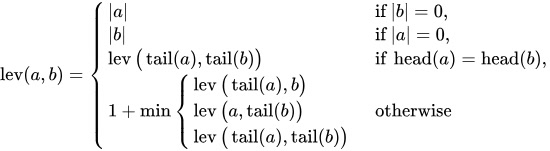

# Creating a simple string Search

Recently, I helped implement a feature on the [Marmite](https://github.com/rochacbruno/marmite) project, which was adding a static search into the project. The idea of course, allow users to search content inside their markdown files.

For this, the author of the Marmite project suggested the usage of [Fuse.js](https://www.fusejs.io/). On their website, they describe themselves as "Powerful, lightweight fuzzy-search library, with zero dependencies".

The library itself was very easy to use, and very straightforward to add to the project, but after that it got me thinking about how fuzzy matching works.

In past years I have worked in another project where we had the need to match names of researchers from different sources (as SciELO, PubMed, etc). For this, at the time, we used the [Jaro-Winkler distance](https://en.wikipedia.org/wiki/Jaro%E2%80%93Winkler_distance) algorithm, and it worked well (the idea of this algorithm is to measure the similarity between strings, specially if the have a "common prefix").

So in this post, I'm going to discuss a little bit about a bunch os aspects about how we could search for a string inside a bunch of documents.

## How to measure the difference between words?

Well, that's the whole point right? Over decadess, people thought about this, and create algorithms to measure the difference between words.

Here's a small list of algorithms (this list is not exhaustive).:

- [Levenshtein distance](https://en.wikipedia.org/wiki/Levenshtein_distance)
- [Jaro-Winkler distance](https://en.wikipedia.org/wiki/Jaro%E2%80%93Winkler_distance)
- [Hamming distance](https://en.wikipedia.org/wiki/Hamming_distance)
- [Damerau-Levenshtein distance](https://en.wikipedia.org/wiki/Damerau%E2%80%93Levenshtein_distance)

Those algorithms (and many more) are used to measure the difference between words, each have it's own way of doing, an in most cases, they're good for different scenarios. The main idea is to check what changed betweem two words, and in a sense, how much they're different (in quantitatve terms).

But, of course, using only those algorithms don't tell us the whole story. Because normally we're search for a word (or words) in documents, or in a list of words (we might call this a paragraph), and in this case, we would need to run the algorithm for each word.

Well, we still need to do this, regardless what I'm going to say now to you, but we can use some Natural Language Processing (NLP) techniques to help us improve the search.

## Natural Language Processing (NLP)

There's a even bigger field of study trying to understand the relationship between words, and how to model this relationship.

I might say that NLP got much more attention in recent years, and with the rise of Machine Learning, it got even more attention. Over the years, more and more documents were digitized (or being created over the internet), and in most case we need to extract the information from those documents (or extract "intelligence" from them).

With the rise of LLM (Large Language Models), I also seeing a rise in it's usage instead of traditional NLP techniques. But, for most common cases, traditional NLP techniques are very useful.

For the case of fuzzy matching, as I mentioned before, could help us improve the search, and used as a initial or secondary filter.

Here, I'll present a simple example of how to use one of the algorithms I mentioned before, the Levenshtein distance, leveraging the search in a simple dataset.
The documents will be pre processed, using [Stemming](https://en.wikipedia.org/wiki/Stemming) (so we would compare the root of the words, instead of the words itself) and we'll use word count to create a matrix of the documents (so we can rank then in terms of "importance" of that word).

Keep in mind that this is a very simple example, but it shows the integration between different techniques.

So, let's get started.

## Levenstein

The idea behind Levenstein is to check what's need to be changed on the fist word so it becomes the second word. This means, we check for insertions, deletions and substitutions.

On Wikipedia you can see the formula for the algorithm... But I just copy and paste here:



Bellow is the alogorithm implemented in Python. Using a matrix to store the values I think it's easier to observe and understand the algorithm (at least for me ... hahahaha).

```python
def levenstein(str1: str, str2: str) -> int:
    """Returns the Levenshtein distance between two strings."""
    if str1 == str2:
        return 0

    n, m = len(str1) + 1, len(str2) + 1  # get the length of the words

    matrix = [[0 for _ in range(m)] for _ in range(n)]  # create a matrix NxM with the size of the words

    for i in range(1, n):
        matrix[i][0] = i  # fill the first column with the index of the word
        for j in range(1, m):
            matrix[0][j] = j  # fill the first row with the index of the word
            if str1[i - 1] == str2[j - 1]:  # if the letters are the same, we don't need to change anything
                matrix[i][j] = matrix[i - 1][j - 1]  # so we copy the value from the diagonal
            else:
                # if the letters are different, we need to change, so we get the minimum value from the diagonal, the left and the top + 1
                matrix[i][j] = 1 + min(matrix[i - 1][j], matrix[i][j - 1], matrix[i - 1][j - 1])

    return matrix[-1][-1]  # return the last value of the matrix


str1 = "kitten"
str2 = "sitting"
print(levenstein(str1, str2))
# >> 3
# [
#     [0, 1, 2, 3, 4, 5, 6, 7],
#     [1, 1, 2, 3, 4, 5, 6, 7],
#     [2, 2, 1, 2, 3, 4, 5, 6],
#     [3, 3, 2, 1, 2, 3, 4, 5],
#     [4, 4, 3, 2, 1, 2, 3, 4],
#     [5, 5, 4, 3, 2, 2, 3, 4],
#     [6, 6, 5, 4, 3, 3, 2, 3]
# ]
```

In the example above, we're comparing the words "kitten" and "sitting". The result is 3, which means that we need to change 3 letters to make the words equal.

So, the lower the returned value, the more similar the words are.

As I mentioned, there're other algorithms to measure similarity between words, in here we're checking the similiarity between raw strings, but, we could also find similiarity between words using a vector space ([Word Embeddings](https://en.wikipedia.org/wiki/Word_embedding)), applying [Cosine similarity](https://en.wikipedia.org/wiki/Cosine_similarity) algorithm for that porpuse.

This is totally out of scope for this article (I mean, I'm all for Word Embeddings and I created one using [Word2Vec](https://en.wikipedia.org/wiki/Word2vec) in the past, check my github if you're interest [WordEmbeddingPortugues](https://github.com/rdenadai/WordEmbeddingPortugues)), but I think it's worth mentioning.

## Stemming + Counting Words

Another approach we can take to search for words in a document is to use the [TF-IDF](https://en.wikipedia.org/wiki/Tf%E2%80%93idf) algorithm for example.

For simplicity (because I'm lazy and I don't want to discuss about TF-IDF here), I'll use the simpler Word Count algorithm. This means we'll count the words in a document, and create a document-word matrix.

We're also going to stem the words (reduce them to their roots to make comparisons easier, so 'running' and 'run' are treated as the same word), which makes easier to find words that has the same root, but might appear in different variations.

To keep it very easy, I'll use the good and old [scikit-learn](https://scikit-learn.org/stable/) library to do the heavy lifting (though this part could be done by hand, making it an exercise for the faint of heart).

## "Regular" string search

There's also a bunch of algorithms to search for a string inside another string, and in Python we have the `in` operator to do this.

You can check the [Boyer-Moore](https://en.wikipedia.org/wiki/Boyer%E2%80%93Moore_string-search_algorithm) algorithm in this Wikipedia page.

For practical purposes, I attempted to implement a simplified version of the Boyer-Moore algorithm (kind of, It’s not an exact implementation, but tryed to get the main idea).

Anyway, let's create a simple function that, given two strings, it returns `True` if the first string is inside the second string, or `False` otherwise.

```python
def boyer_more_search(str1: str, str2: str) -> bool:
    """Returns True if the pattern is found in the text using the Boyer-Moore algorithm (kind of)."""
    if not (str1 and str2):
        return False
    if str1 == str2:
        return True

    # create a dictionary with the last index of each letter in the pattern
    letter_position = defaultdict(list)
    for idx, letter in enumerate(str2):
        letter_position[letter].append(idx)
    # get all the positions of the last letter of the pattern
    if positions := letter_position.get(str1[-1], []):
        n = len(str1)
        for position in positions:
            k, j = position, n - 1
            # check if the letters are the same
            while str1[j - 1] == str2[k - 1]:
                k -= 1
                j -= 1
                # if we reach the end of the pattern, we found it
                if j == 0:
                    return True
    return False

print(boyer_more_search("classico", "comeca agora um classico do futebol, um classico incrivel, como vc nunca viu"))
# >> True
```

## Full example

Since
For this I asked ChatGPT to create a bunch of small headlines (why not?), and I'll use then as the documents to search.

```python
dataset = [
    "Economia mundial enfrenta novas incertezas, diz especialista.",
    "Tecnologia avança e promete revolucionar o setor educacional.",
    "Clima instável gera preocupação em áreas agrícolas.",
    "Novo estudo destaca os benefícios do café para a saúde.",
    "Mercado de trabalho aquecido para programadores experientes.",
    "Python segue como uma das linguagens mais populares do mundo.",
    "Startups de IA ganham força e atraem investidores.",
    "Previsão do tempo indica chuvas intensas na próxima semana.",
    "Pesquisadores descobrem novos efeitos do café na produtividade.",
    "Empresas buscam soluções sustentáveis para enfrentar crise energética.",
    "Jogos clássicos de RPG ganham nova popularidade entre jovens.",
    "Novas tecnologias prometem aumentar segurança de dados online.",
    "Programadores discutem melhores práticas para desenvolvimento ágil.",
    "Indústria de videogames ultrapassa recordes de faturamento.",
    "Cresce a procura por cafés especiais em regiões urbanas.",
    "Especialistas alertam sobre riscos do excesso de trabalho.",
    "Exploração espacial: novo foguete é lançado com sucesso.",
    "Pequenos negócios apostam na inovação para se destacar.",
    "Pesquisa indica aumento de interesse em programação funcional.",
    "Exploradores revelam segredos escondidos nas profundezas do oceano.",
]
```

For cases like this, your search will be as good as your data pre processing pipeline, don't get affraid of bellow code, I wrapped around in a class all the steps and libraries we need to run to search a word inside our dataset.

```python
from unicodedata import normalize

from nltk.corpus import stopwords
from nltk.stem.rslp import RSLPStemmer
from nltk.stem.snowball import PortugueseStemmer
from nltk.tokenize import word_tokenize
from sklearn.feature_extraction.text import CountVectorizer

# if you don't have the punkt tokenizer, you need to download it
# nltk_download("punkt_tab")

class DocumentSearch:
    def __init__(self, dataset: list[str], stopwords: list[str], vectorizer: CountVectorizer = CountVectorizer) -> None:
        self._dataset = dataset
        self._stopwords = stopwords

        # adding two stemmers, one only might not work for some words
        self._stemmers = (RSLPStemmer(), PortugueseStemmer())
        self._analyzer = vectorizer(stop_words=self._stopwords, ngram_range=(1, 3)).build_analyzer()
        self._stem_vectorizer = vectorizer(analyzer=self._stemmed_words)
        self._model = self._stem_vectorizer.fit_transform(self._dataset)

    def get_similar_documents(self, query: str, top_k: int = 5) -> list:
        """Returns the top k most similar documents to the query."""
        return list(
            {
                document[0]: document[1]
                for document in sorted(
                    (
                        *self.get_similar_documents_using_vectorizer(query, 10),
                        *self.get_similar_documents_using_levenstein(query, 10),
                        *self.get_similar_documents_using_regular(query, 10),
                    ),
                    key=lambda x: x[1],
                )
            }.keys()
        )[:top_k]

    def _stemmed_words(self, doc) -> list[str]:
        """Tokenizes and stems the words in a document."""
        stemmed_words = []
        for token in self._analyzer(doc):
            stemmed = self._remove_accents(token)  # removing accents
            for stemmer in self._stemmers:
                stemmed = stemmer.stem(stemmed)
            stemmed_words.append(stemmed)
        return stemmed_words

    def _remove_accents(self, text: str) -> str:
        return normalize("NFKD", text).encode("ASCII", "ignore").decode("ASCII")

    def get_similar_documents_using_vectorizer(self, query: str, top_k: int = 1) -> list:
        """Returns the top k most similar documents to the query using the CountVectorizer."""
        query_vector = self._stem_vectorizer.transform([query])
        documents = (
            (dataset[idx], float(query_vector.dot(doc_vector.T).toarray()[0][0]))
            for idx, doc_vector in enumerate(self._model)
        )
        documents = (doc for doc in documents if doc[1] > 0)
        return sorted(documents, key=lambda x: x[1], reverse=True)[:top_k]

    def get_similar_documents_using_levenstein(self, query: str, top_k: int = 5) -> list:
        """Returns the top k most similar documents to the query using the Levenstein distance."""
        doc_distances = []
        for idx, doc in enumerate(self._dataset):
            distances = (
                levenstein(self._remove_accents(token), self._remove_accents(query))
                for token in word_tokenize(doc, language="portuguese")  # tokenize the document
                if token not in self._stopwords
            )
            if (distance := min(distances)) <= 3:  # 3 is the threshold
                doc_distances.append((dataset[idx], distance))
        return sorted(doc_distances, key=lambda x: x[1])[:top_k]

    def get_similar_documents_using_regular(self, query: str, top_k: int = 5) -> list:
        """Returns the top k most similar documents to the query using the regular approach (search in)."""
        doc_distances = []
        for idx, doc in enumerate(self._dataset):
            distances = (
                boyer_more_search(self._remove_accents(query), self._remove_accents(token))  # removing accents
                for token in word_tokenize(doc, language="portuguese")  # tokenize the document
                if token not in self._stopwords
            )
            if any(distances):  # at least one token is similar
                doc_distances.append((dataset[idx], sum(distances)))
        return sorted(doc_distances, key=lambda x: x[1])[:top_k]


document_search = DocumentSearch(dataset=dataset, stopwords=stopwords.words("portuguese"))
print(document_search.get_similar_documents("classicos"))
# >> ['Jogos clássicos de RPG ganham nova popularidade entre jovens.']

print(document_search.get_similar_documents("cafe"))
# >> ['Novo estudo destaca os benefícios do café para a saúde.', 'Pesquisadores descobrem novos efeitos do café na produtividade.', 'Cresce a procura por cafés especiais em regiões urbanas.', 'Empresas buscam soluções sustentáveis para enfrentar crise energética.']
```

I know, I know, it's a lot of code, it's not optimized, you should not use this in production and so on ... well the idea here is for demonstration purposes anyway.

The class `DocumentSearch`, as is a wrapper to the whole process, and I'm leveraging three different ways to search the documents, join all documents found and return as a list of top k documents.

## Final thoughts

The idea here was to explore a little bit, different ways (and algorithms) to search for a words inside another word, in a paragraph or in a document.

This field is vast, and this article only scratches a tiny part of a whole! Hopefully this will encourage you to explore more, dive deeper into this topic, and practice your skills building other algorithms.

For the Pythonistas out there, you could leverage scikit-learn as demonstrated, but there are also excellent libraries like [Jellyfish](https://jamesturk.github.io/jellyfish/), which implements (I dare to say) implements nearly all the major algorithms for fuzzy matching.

Thanks and see you next time 😉!
