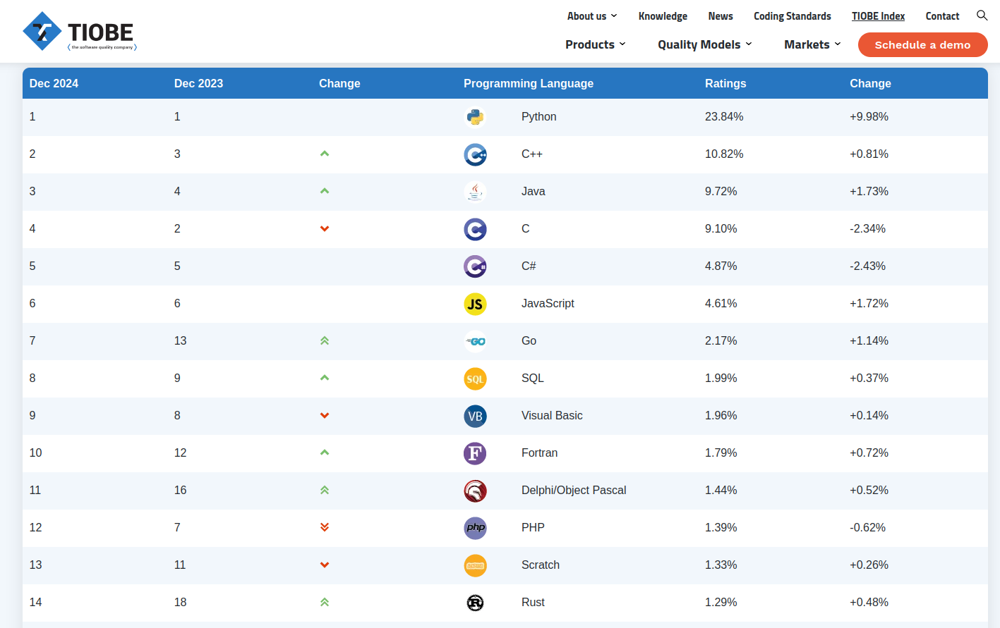

## What to Expect in 2025: My Take on some Tech Trends

This is my take on what to expect for 2025. Keep in mind that this is my personal opinion, based on possibilities and trends that I’ve been following closely (or lately). Let’s dive into some of the key areas I believe will shape the tech landscape next year.

### 1. Rust and Go languages continue their Rise

I think this is a great example of two languages that are gaining popularity over the years. Both Rust and Go were created about 10-15 years ago (I'm using their 1.0 versions as a reference: Rust in 2015 [v1.0] and Go in 2012 [v1.0]), but in recent years their popularity has grown a lot. I think this is because people are looking for better approaches to solve problems, driven by curiosity, and/or to study new languages.

I don't think I can say that both languages were created to overcome the problems of other languages (yes, I'm talking about C and C++). They were developed around the same time, and both languages fit into that space.

I'm seeing more and more adoption of both languages in the industry: Rust in more systems and critical applications, while Go's penetration is greater in cloud and backend applications.

My bet here is that both will continue to grow in 2025, and we'll probably see more and more companies adopt Go as their main language for backend development, replacing JavaScript / TypeScript, and even Java. That said, I think we'll see a major surge in Go's popularity in 2025.

As I'm writing this, Go has climbed from position 13 to 7 in just one year. I would attribute this rise in popularity especially to the language's ease of use and performance. Since I'm not a Go developer, I'm not familiar with the frameworks and libraries used to implement large enterprise applications, but it appears that this is the direction Go is heading. This means that well-established languages like Java (and, in recent years, JavaScript/TypeScript) will probably lose some market share.

As for Rust, I think the path is much clearer, and Rust does one thing that most developers want: replace C++ and maybe even C (it's possible, I mean). Anyway, we're still going to watch that rise in popularity (on TIOBE, Go's jump from last year was more impressive), and Rust will spread across more domains.

For Rust, I would like to see more adoption in web development and machine learning (this would definitely help the language grow). I think the slow rate of adoption is directly related to how hard it is to learn the language, especially for new developers.

> **_My Take: If you're starting in the area, choose Go. You'll probably find more job opportunities in backend development. But keep in mind that this is about doing what I'm telling you to do, not what I'm doing. I’m more leaning towards Rust._**

**LinkedIn stats:**

| Go in Brazil | Rust in Brazil |
| ------------ | -------------- |
| 3,002        | 1,373          |

### 2. Python 3.14: JIT and Free-Threaded Improvements

Python 3.14 is set to be a game-changer. The anticipated Just-In-Time (JIT) compiler and the move toward free-threading could address some of the long-standing performance criticisms of Python, especially in multi-threaded applications. These improvements might lead to:

- Greater adoption of Python in performance-critical applications.
- Enhanced scalability for data science, AI, and web applications.
- Renewed interest in Python from developers who previously leaned toward faster languages.

### 3. Generative AI: Evolving and Expanding

Generative AI (GenAI) will undoubtedly remain in the spotlight throughout 2025. Companies, both startups and established giants, will continue to explore innovative ways to harness its capabilities. Here’s what I’m watching:

#### 3.1. The Text-to-Video Revolution

The release of **Sora**, a new tool in text-to-video generation, could kickstart a major trend. With advancements in video generation, we might see:

- More accessible tools for creating high-quality video content from text prompts.
- Increased adoption in marketing, entertainment, and education.

#### 3.2. Better Agents for Full Code Generation Tasks

Better LLM agents like **DEvin**, which promise to change the way we produce code, could become more prominent. These agents are designed to interact with platforms like GitHub, creating pull requests, incorporating feedback through reviews, and iteratively improving the code. This workflow might:

- Simplify collaboration between AI and developers.
- Increase efficiency in managing codebases.
- Further streamline software development processes.

#### 3.3. Audio Generation: A Slow Climb

While text-to-video gains traction, audio generation—despite its potential—still seems to be lagging in industry attention. Incremental improvements are likely, but a significant breakthrough may still be a few years away.

#### 3.4. Environmental Concerns

The environmental impact of AI continues to be a hot topic. With Bloomberg’s recent report highlighting the energy costs of large AI models, 2025 could see:

- More discussions on sustainable AI practices.
- Development of energy-efficient AI models.
- Increased pressure on tech companies to disclose and reduce their carbon footprint.

### 4. The Social Media Split

The landscape of social media may shift dramatically in 2025. The end of 2024 saw a significant exodus of users from X (formerly Twitter) to alternative platforms. This migration was fueled by Elon Musk’s public endorsement of Donald Trump, leading to backlash and distrust among certain user groups. Here’s what I expect:

- A fragmented social media ecosystem, with users distributed across multiple platforms.
- Increased prominence of decentralized platforms like Mastodon and Bluesky.
- Challenges for advertisers and brands in navigating this fractured space.
- A redefinition of what constitutes the “mainstream” social media experience.
